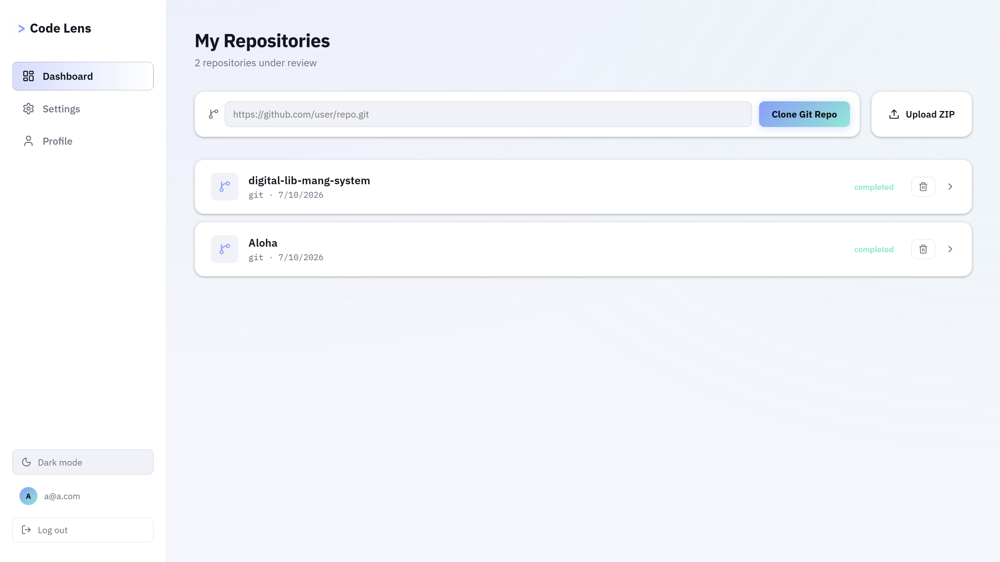
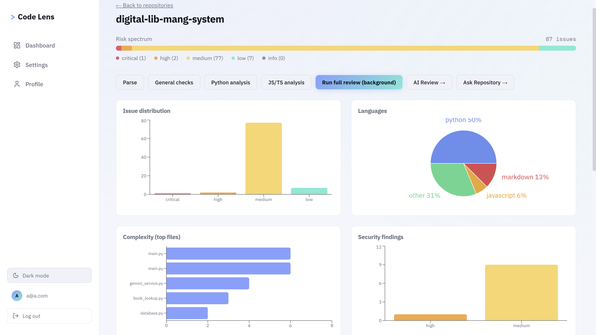
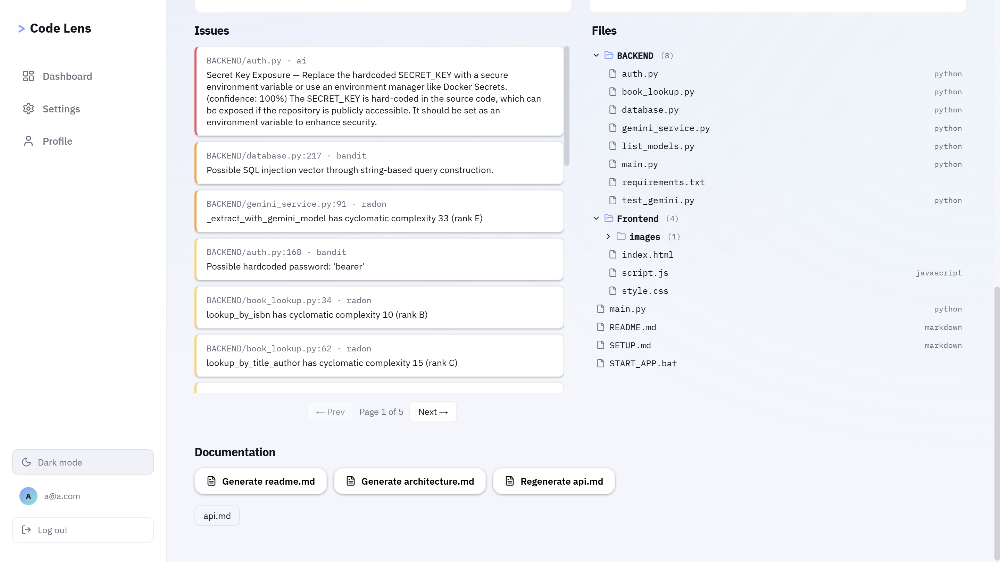
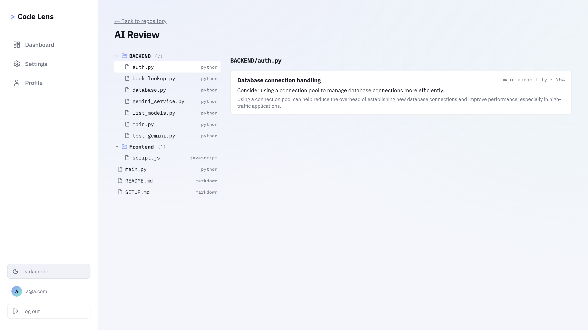
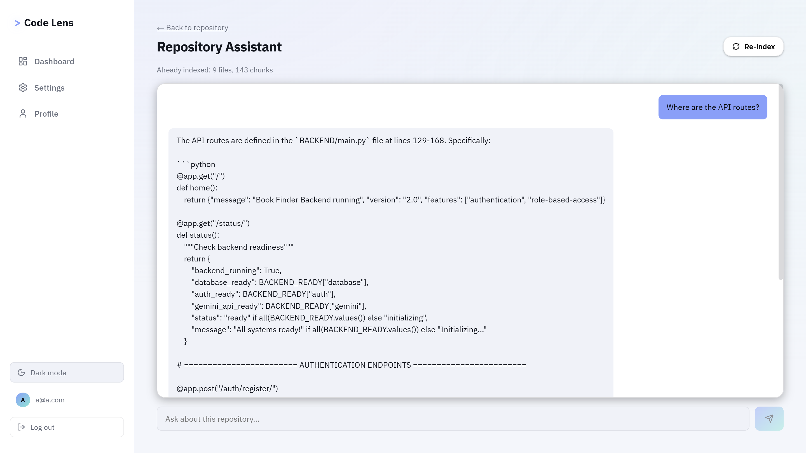
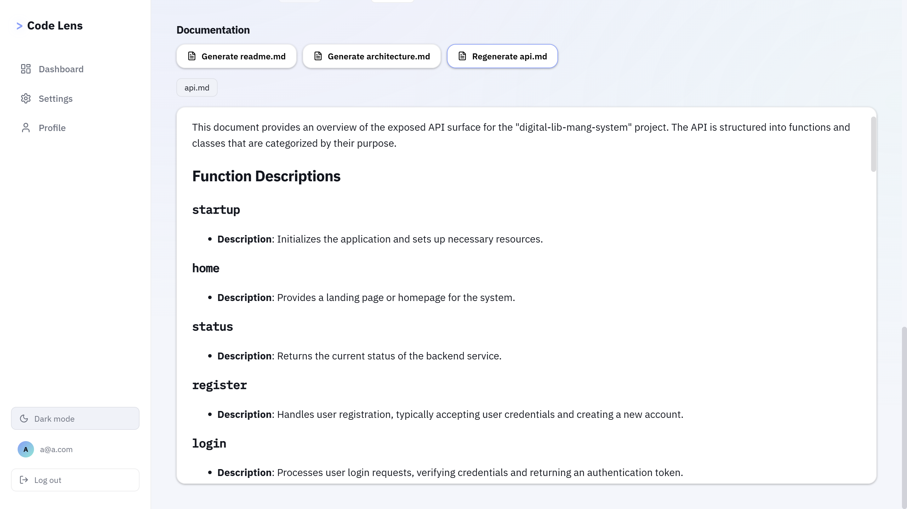

# CodeLens — AI-Powered Code Review Platform


A self-hosted platform that reviews code the way a senior engineer would: static analysis, AI-powered review, automatic documentation, and a chat assistant that understands your codebase — all running on local, private infrastructure.

Upload a repository (ZIP or Git clone) and get:
- **Static analysis** across Python, JavaScript, and TypeScript (Ruff, Bandit, Radon, ESLint, tsc)
- **AI code review** with streaming, per-file feedback (bugs, security, performance, style)
- **Auto-generated documentation** (README, architecture, API docs)
- **Repository chat** — ask questions about the codebase, get answers grounded in real retrieved code (RAG)
- **Background job processing** so uploads and reviews never block the UI

---

## Screenshots

### Dashboard


### Repository Overview


### Analysis


### AI Code Review


### Repository Chat (RAG)


### Auto-Generated Documentation


---

## Tech Stack

| Layer              | Technology                                              |
|--------------------|----------------------------------------------------------|
| Frontend           | React, TypeScript, Vite, React Router, Recharts          |
| Backend            | Node.js, Express, TypeScript                             |
| Database           | PostgreSQL                                               |
| Queue / Jobs       | BullMQ + Redis                                           |
| AI / LLM           | Ollama (local), Qwen2.5-Coder                            |
| Embeddings         | nomic-embed-text (via Ollama)                            |
| Static Analysis    | Ruff, Bandit, Radon (Python) · ESLint, tsc (JS/TS)       |
| Auth               | JWT + bcrypt                                              |

**Note on architecture choices:** this project deviates from a common "FastAPI + Next.js + Celery + Qdrant" blueprint in a few places — Express replaces FastAPI, BullMQ replaces Celery, and Postgres-based cosine similarity replaces a dedicated vector DB (Qdrant/Chroma). These were deliberate substitutions for a Node-based, dependency-light local setup; the architecture and data flow are equivalent.

---

## Architecture

```
                      React (Vite) UI
                            │
                         REST API
                            │
                    Express Backend
                            │
        ┌───────────┬───────────────┬──────────────┐
        │           │               │              │
   PostgreSQL      Redis         BullMQ          Ollama
        │                       Worker              │
        │                          │        Qwen2.5-Coder
   Repository                Background      nomic-embed-text
   Metadata                    Jobs
        │
   Repository Files
        │
   Static Analysis Engine
   (Ruff / Bandit / Radon / ESLint / tsc)
        │
   Chunking → Embeddings → Postgres (vector similarity)
        │
   Retrieval-Augmented Chat
```

Full request lifecycle for a repository:
1. **Upload/Clone** → stored on disk, metadata in Postgres
2. **Parse** → file walker extracts structure, symbols, languages
3. **Analyze** → static analyzers run (sync or queued as a background job)
4. **AI Review** → per-file LLM review, streamed to the client
5. **Document** → LLM generates README/Architecture/API docs from repo context
6. **Chat** → repository chunked + embedded, questions answered via retrieval

---

## Getting Started

### Setup

For a complete, step-by-step install guide (Node, PostgreSQL, Redis via WSL, Python tools, Ollama), see [SETUP.md](./SETUP.md).

### Prerequisites
- Node.js 20+
- PostgreSQL 16+
- Redis (via WSL2 on Windows, native on Linux/Mac)
- Python 3.11+ with `ruff`, `bandit`, `radon` installed (`pip install ruff bandit radon`)
- [Ollama](https://ollama.com) with `qwen2.5-coder:3b` (or `7b`) and `nomic-embed-text` pulled

### Setup

```bash
git clone <your-repo-url>
cd ai-code-review

# Backend
cd backend
npm install
cp .env.example .env   # edit DB/Redis/JWT/Ollama values
npm run migrate
npm run dev             # starts API on :4000

# Worker (separate terminal)
npm run worker

# Frontend (separate terminal)
cd ../frontend
npm install
npm run dev              # starts UI on :5173
```

Visit `http://localhost:5173`, register an account, and upload or clone a repository.

See [DEVELOPER_GUIDE.md](./DEVELOPER_GUIDE.md) for a deeper walkthrough of the codebase, and [DEPLOYMENT.md](./DEPLOYMENT.md) for production deployment on a VPS.

---

## Project Structure

```
backend/
├── src/
│   ├── routes/       # API endpoints (auth, repos, parse, analyze, ai-review, jobs, docs, rag)
│   ├── lib/          # Core logic (walker, extractors, static analysis tools, Ollama client, RAG)
│   ├── middleware/   # Auth guard, error handling
│   ├── db/           # Schema + migration runner
│   └── worker.ts     # Background job processor (parse → analyze → AI review pipeline)
└── package.json

frontend/
├── src/
│   ├── pages/        # Dashboard, Repository, Review, Chat, Settings, Profile, Login/Register
│   ├── components/   # Layout, sidebar
│   └── lib/          # API client, auth/theme context, shared file-tree component
└── package.json
```

---

## Known Limitations

Documented honestly rather than hidden:
- **Symbol extraction is regex-based**, not AST-based — handles common patterns well but misses arrow functions, multi-line signatures, and nested scopes. A tree-sitter upgrade is the natural next step if higher fidelity is needed.
- **RAG index is a point-in-time snapshot** — re-index after repository changes to keep chat answers current.
- **Small local LLMs (3b) can hallucinate** on open-ended generation (e.g. README descriptions) even when given accurate context; factual/structural doc types (Architecture, API) ground much better since they map directly to real symbols.
- **No dedicated vector database** — uses Postgres + in-memory cosine similarity, which is fine at hundreds of chunks but wouldn't scale to very large monorepos without a real vector store.
- **Static analysis covers Python and JS/TS only** — Java, Go, Rust, C++ are detected/parsed but not linted.

---

## Contributing

See [CONTRIBUTING.md](./CONTRIBUTING.md).

## Changelog

See [CHANGELOG.md](./CHANGELOG.md).

## License

MIT — see [LICENSE](./LICENSE).

---

Built by Emm Zee!!